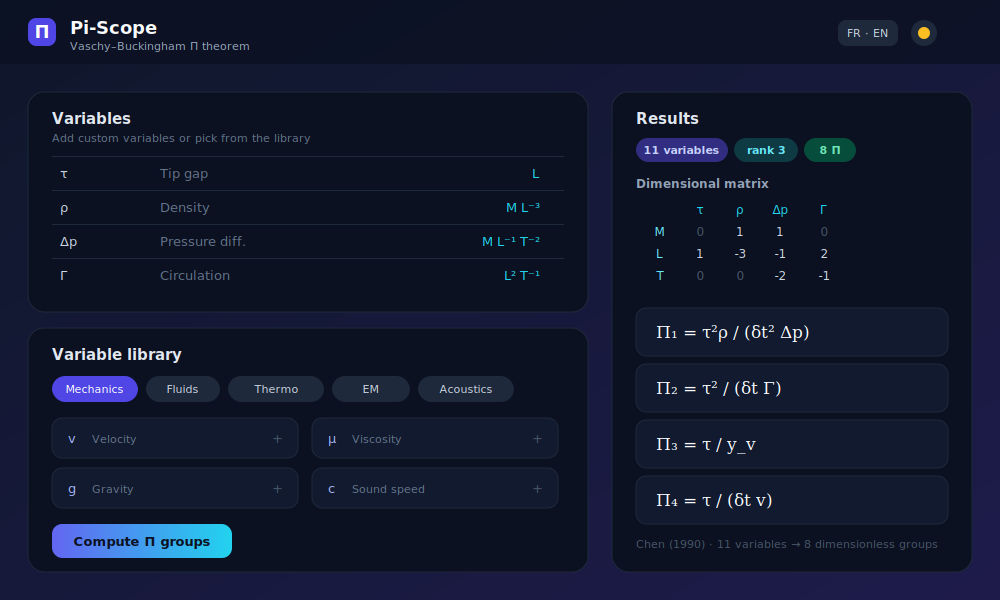
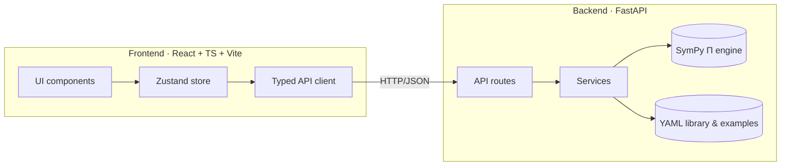

<div align="center">

# Π Pi-Scope

### Dimensional analysis, reimagined for the web.

**Pi-Scope** turns a set of dimensioned physical variables into the dimensionless
groups that govern them, using the **Vaschy–Buckingham (Π) theorem** — with a
modern, bilingual, theme-aware interface and a rigorous SymPy-powered engine.

[](https://github.com/vcaries/pi-scope/actions/workflows/ci.yml)
[](LICENSE)
[](https://www.python.org/)
[](https://fastapi.tiangolo.com/)
[](https://react.dev/)
[](https://www.typescriptlang.org/)
[](https://github.com/astral-sh/ruff)

</div>

---

## Overview

The **Buckingham Π theorem** is a cornerstone of dimensional analysis: any
physically meaningful equation involving *n* variables can be rewritten in terms
of *n − k* independent **dimensionless groups**, where *k* is the number of
independent base dimensions involved. Pi-Scope automates this reduction and
presents it beautifully.

It began as a single Python script (`pi_theorem.py`) reproducing the similarity
parameters from *Chen et al., 1990*. This repository elevates that idea into a
full, production-grade web application that demonstrates scientific computing, a
clean software architecture, and modern engineering-focused UX.

> **Try the flagship example in one click:** the compressor tip-clearance case
> from Chen (1990) — 11 variables reduced to 8 dimensionless groups.

## Features

- **Rigorous engine** — exact rational linear algebra via SymPy; integer-reduced,
  sign-normalised Π groups; full **7 SI base dimensions** (M, L, T, Θ, I, N, J).
- **Curated variable library** — dozens of quantities organised by physics domain
  (mechanics, fluids, thermodynamics, heat transfer, electromagnetism, acoustics,
  energetics, aerodynamics), each with symbol, name, SI unit and description.
- **Worked examples** — preloaded, citeable case studies (Chen 1990, Reynolds,
  drag on a sphere, forced convection).
- **Beautiful math** — equations rendered with **KaTeX**; the dimensional matrix
  is shown explicitly alongside its rank.
- **Modern UX** — light/dark themes, full **French / English** internationalisation,
  responsive layout, subtle animations, copy-to-clipboard, and JSON / LaTeX export.
- **Clean architecture** — decoupled FastAPI backend and React + TypeScript
  frontend, typed end-to-end, fully tested, containerised.

## Screenshots



> The image above is a mockup placeholder. Replace it with real captures /
> a demo GIF in `docs/screenshots/` — see that folder's README for tips.

## Architecture at a glance



See [`docs/ARCHITECTURE.md`](docs/ARCHITECTURE.md) for the full design.

## Quick start

### Option A — Docker (one command)

```bash
docker compose up --build
# Frontend: http://localhost:8080   ·   API docs: http://localhost:8000/docs
```

### Option B — Local development

**Backend** (Python 3.10+):

```bash
cd backend
python -m venv .venv && source .venv/bin/activate   # Windows: .venv\Scripts\activate
pip install -r requirements-dev.txt
uvicorn app.main:app --reload --port 8000           # http://localhost:8000/docs
```

**Frontend** (Node 18+):

```bash
cd frontend
npm install
npm run dev                                          # http://localhost:5173
```

The Vite dev server proxies `/api` to the backend on port 8000, so the two run
side by side with no CORS setup.

> A `Makefile` wraps the common tasks: `make help`, `make dev-backend`,
> `make dev-frontend`, `make test`, `make lint`, `make build`.

## Project structure

```
pi_theorem/
├── backend/            # FastAPI + SymPy scientific engine and API
│   ├── app/
│   │   ├── core/       # Pure engine: dimensions, Pi theorem (no web deps)
│   │   ├── api/        # Routers (health, pi, library, examples)
│   │   ├── models/     # Pydantic schemas (API contract)
│   │   ├── services/   # Library, examples, solver adapter
│   │   └── data/       # YAML variable library & worked examples
│   └── tests/          # pytest suite (engine + API)
├── frontend/           # React + TypeScript + Vite + Tailwind UI
│   └── src/            # components, store, i18n, api client, hooks, lib
├── docs/               # Architecture, stack, roadmap, UI/UX, Git guide…
├── legacy/             # Original PyQt5 script, preserved for reference
├── docker-compose.yml
└── Makefile
```

## Scientific background

Given variables with dimensional formulae, Pi-Scope builds the **dimensional
matrix** *D* (rows = active base dimensions, columns = variables), computes a
basis of its **null space**, and turns each basis vector into a dimensionless
group. The number of independent groups is `n − rank(D)`. Exponents are scaled
to the smallest integers and sign-normalised for a conventional presentation.

The flagship example reproduces the dimensionless parameters of:

> Chen, G.T.; Greitzer, E.M.; Tan, C.S.; Marble, F.E. *Similarity Analysis of
> Compressor Tip Clearance Flow Structure* (1990).

## API reference

Interactive docs are served at `/docs` (Swagger) and `/redoc`. Key endpoints:

| Method | Path | Description |
| --- | --- | --- |
| `GET` | `/api/health` | Liveness probe and metadata |
| `POST` | `/api/pi/solve` | Compute the Π groups for a set of variables |
| `GET` | `/api/library` | SI base dimensions + curated variable library |
| `GET` | `/api/examples` | List worked examples |
| `GET` | `/api/examples/{id}` | Fetch one worked example |

## Testing & quality

```bash
cd backend && pytest            # unit + integration tests
cd backend && ruff check . && mypy app
cd frontend && npm run typecheck && npm run build
```

CI runs all of the above on every push and pull request across Python 3.10 and
3.12 (see [`.github/workflows/ci.yml`](.github/workflows/ci.yml)).

## Documentation

- [Architecture](docs/ARCHITECTURE.md) · [Technology stack](docs/STACK.md)
- [Roadmap](docs/ROADMAP.md) · [UI/UX design](docs/UI_UX.md)
- [Git & GitHub guide](docs/GIT_GUIDE.md) · [Future improvements](docs/FUTURE.md)

## Contributing

Contributions are welcome! Please read [`CONTRIBUTING.md`](CONTRIBUTING.md) and
follow the [Conventional Commits](https://www.conventionalcommits.org) style.

## License

Released under the [MIT License](LICENSE) © 2026 V. Caries.
