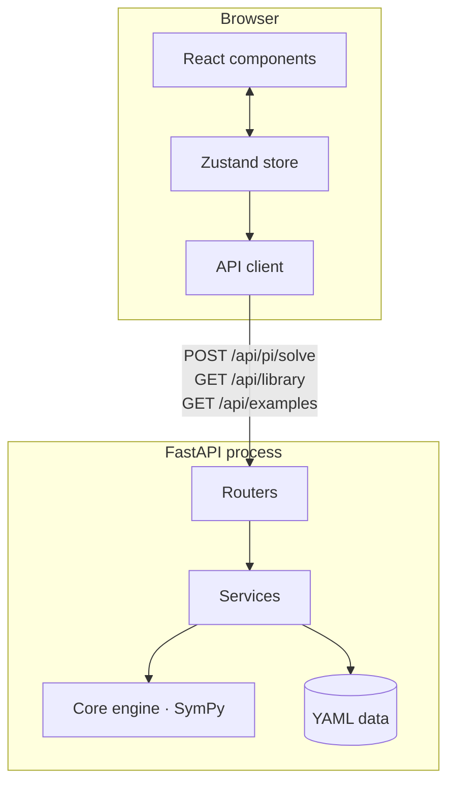
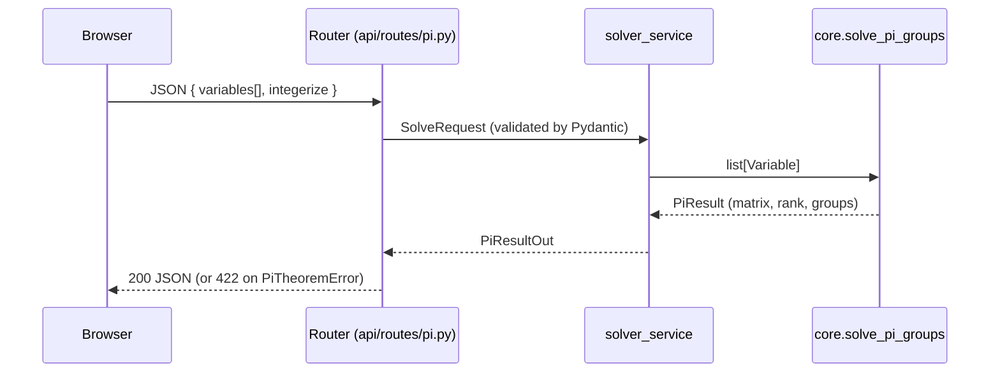

# Architecture

Pi-Scope is a decoupled two-tier application: a **Python scientific backend** and
a **TypeScript web frontend**, communicating over a typed HTTP/JSON contract.
The split is deliberate: the science is testable in isolation, and either tier
can evolve, be replaced, or be deployed independently.

## High-level diagram



## Layered backend

The backend follows a strict dependency direction: **outer layers depend on inner
layers, never the reverse.**

```
api  ─────►  services  ─────►  core (engine)
 │               │
 └──► models ◄───┘        (Pydantic schemas: the wire contract)
```

| Layer | Package | Responsibility | Depends on |
| --- | --- | --- | --- |
| **Core** | `app.core` | Pure dimensional analysis. No web, no I/O. | stdlib, SymPy |
| **Models** | `app.models` | Pydantic request/response schemas. | pydantic |
| **Services** | `app.services` | Use-cases: load library/examples, adapt schemas ↔ engine. | core, models |
| **API** | `app.api` | HTTP routing, status codes, dependency injection. | services, models |
| **App** | `app.main` | Application factory, middleware, configuration. | api, config |

### Why the core is web-free

`app.core` has **zero** FastAPI/Pydantic imports. This means the engine can be:

- imported into a Jupyter notebook or another Python project,
- driven from a CLI,
- unit-tested without spinning up a server,
- ported to another transport (gRPC, CLI, batch) with no rewrite.

The original `pi_theorem.py` is conceptually preserved here as
`app/core/pi_theorem.py`, but upgraded to return rich structured results instead
of printing to `stdout`.

## The engine

`solve_pi_groups(variables)` performs the following steps:

1. **Validate** inputs (≥ 2 variables, unique symbols).
2. **Select active dimensions** — only base dimensions with a non-zero exponent
   in some variable become matrix rows, keeping the displayed matrix compact.
3. **Assemble the dimensional matrix** `D` (active dims × variables) with SymPy.
4. **Compute** `rank(D)` and the number of groups `p = n − rank`.
5. **Null space** — a basis of `ker(D)` via `D.nullspace()` (exact rationals).
6. **Integerise** each basis vector: multiply by the LCM of denominators, divide
   by the GCD of numerators, sign-normalise the leading term.
7. **Render** each group to LaTeX (`\dfrac{…}{…}`) and ASCII.

All arithmetic uses `fractions.Fraction` / SymPy `Rational`, so results are
**exact** — there is no floating-point drift.

## Request lifecycle (`POST /api/pi/solve`)



Domain failures raise typed exceptions (`PiTheoremError` and subclasses) in the
core; the API layer maps them to `422 Unprocessable Entity` with a clear message,
keeping HTTP concerns out of the science.

## Frontend architecture

```
src/
├── api/        # Typed fetch client; maps API errors to messages
├── store/      # Single Zustand store (variables, library, examples, result)
├── components/ # Presentational + container components
├── hooks/      # useTheme (dark/light, persisted)
├── i18n/       # i18next setup + fr/en resource bundles
├── lib/        # KaTeX wrapper, formatting, export, base-dimension constants
└── types/      # TypeScript mirror of the API contract
```

State management is intentionally lightweight: a **single Zustand store** holds
the working set of variables, the fetched library/examples and the latest result.
This avoids prop-drilling without the ceremony of Redux. Components subscribe to
just the slices they need.

## Configuration & cross-cutting concerns

- **Configuration** is centralised in `app/config.py` (`pydantic-settings`), read
  once from environment / `.env` and cached. Every value has a typed default.
- **Logging** is configured in one place (`app/logging_config.py`) with a single
  readable format; the core uses module-level loggers, never `print`.
- **CORS** is configured from settings so the browser frontend can call the API
  in development and in a future split deployment.

## Deployment model

Locally the two tiers run as separate processes (uvicorn + Vite). For a future
online deployment, each tier has a **Dockerfile**, and `docker-compose.yml`
wires them together (nginx serves the built SPA and reverse-proxies `/api` to the
backend). Because the frontend is a static bundle and the backend is a stateless
API, both scale horizontally and can be hosted on essentially any platform
(Render, Fly.io, a VPS, Hugging Face Spaces, …).
